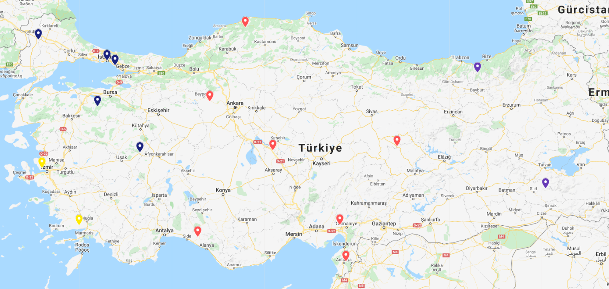

# Sodexo .NET Bootcamp - Third Homework

### Details

- Deadline: 14 Jan 2022
- [Details of homework](https://github.com/Semra4141/ucuncuOdev/files/7841216/Odev3.pdf)

#### K Means Algorithm Testing On Real Map

- At the start of test scenario, we have a vehicle with 8 default containers. I chose the locations of these containers from google maps randomly.
- <strong>Notes:</strong> 
    - <ins> Each color on the map represents a cluster. </ins>
    - <ins> The 'n' parameter represents number of clusters that we request from API. </ins>
    - <ins> The 'c' parameter represents number of containers. </ins>
- The pins on the map colorized by me according to the result from the API.
 

1. First scenario (c = 8, n = 3)

  

2. Second scenario, added 1 more location from map. (c = 9, n = 3)

  

3. Third scenario, added 2 more locations from map. (c = 11, n = 3)

  

4. Fourth scenario, added 5 more locations from map. (c = 16, n = 3)

  

5. Fifth scenario, requested for 4 clusters. (c = 16, n = 4)

  

6. Sixth scenario, requested for 8 clusters. (c = 16, n = 8)

  
